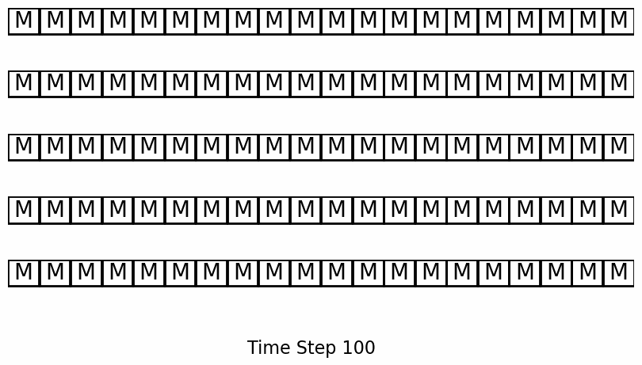
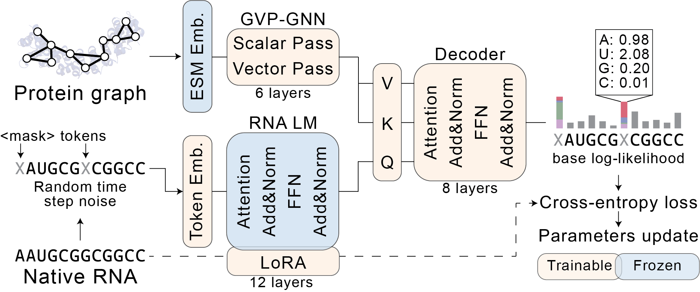

# EchoRNA: Protein-Conditioned RNA Sequence Generation

### Overview
### Key Features
### Architecture
### Contact
### Content List

## Requirements
EchoRNA is build with these packages
### Software
- os, torch, cuda, cudnn, torch-geometric, esm2, esmif, rnafm, etc
### Computing system
- CPU
- GPU

## Installation
### Environment setup
- esm2 smth

## Usage
### Protein feature engineering
### RNA sampling


## Examples
TBD


EchoRNA is a discrete diffusion-based model that generates functional RNA sequences conditioned on three-dimensional protein structures. The model uses absorbing discrete diffusion to sample RNA sequences that exhibit specific binding preferences for RNA-binding proteins (RBPs).

<div align="center">

</div>

*EchoRNA generating RNA sequences containing the UGUA motif known to bind Pumilio-family proteins when conditioned on PUM2 (PDB ID: 3q0q) structure.*

## Key Features

- **Protein-conditioned generation**: Generate RNA sequences from 3D protein structure alone
- **Discrete diffusion**: Uses absorbing diffusion optimized for discrete sequence data
- **Multi-modal architecture**: Integrates RNA-FM language model with GVP-GNN protein encoder
- **Motif preservation**: Generates sequences that recapitulate known binding motifs
- **Variable length support**: Handles RNA sequences from 8-254 nucleotides

## Architecture

EchoRNA consists of three main components:

1. **Protein Encoder**: GVP-GNN with 6 layers processing residue-level graphs with ESM-2 (1280D) and ESM-IF (512D) embeddings
2. **RNA Language Model**: RNA-FM with LoRA adaptations (r=64, α=128) applied to attention layers
3. **Cross-attention Transformer**: Integrates RNA and protein features with timestep conditioning



## Installation

### Environment Setup

The project requires a conda environment with CUDA support. Use the provided environment file:

```bash
# Create environment from the provided YAML
conda env create -f echorna.yaml
conda activate rnpdiffuse

# Or create lemon environment as specified in user instructions
conda activate lemon
```

### Key Dependencies

- PyTorch 2.4.0+cu118 with CUDA 11.8
- torch-geometric 2.5.3
- transformers 4.46.3
- fair-esm 2.0.0
- RNA-FM
- BioPython, pandas, numpy, matplotlib
- Rich (for terminal formatting)

## Usage

### Training

Train EchoRNA using configuration files:

```bash
# Train on EchoRNA dataset
python train.py --config="config/echorna.yaml"

# Train on baseline RF2NA dataset
python train.py --config="config/rf2na.yaml"
```

### Sampling

Generate RNA sequences conditioned on protein structures:

```bash
# Sample using EchoRNA model
python sampling.py --config="sampling_config/EchoRNA.yaml"

# Sample using RF2NA baseline
python sampling.py --config="sampling_config/RF2NA.yaml"
```

### Training Progress

Monitor training progress and generate reports:

```bash
python training_report.py
```

## Configuration

### Training Configuration (`config/`)

Key parameters in `echorna.yaml`:

```yaml
# Model architecture
adaptor_config:
  embed_dim: 640        # RNA-FM embedding dimension
  trans_dim: 640        # Transformer hidden dimension
  num_heads: 20         # Attention heads
  num_trans_layers: 8   # Transformer layers
  gvp_layers: 6         # GVP-GNN layers

# LoRA configuration
lora_config:
  r: 64                 # Low-rank dimension
  lora_alpha: 128       # Scaling factor
  lora_dropout: 0.01    # Dropout rate
  target_modules: ["q_proj", "v_proj", "k_proj", "out_proj", "dense"]

# Training parameters
optimizer:
  lr: 0.001             # Learning rate
  weight_decay: 0.001   # Weight decay
epochs: 50              # Training epochs
batch_size: 20          # Batch size
accumulation_steps: 42  # Gradient accumulation
```

### Sampling Configuration (`sampling_config/`)

Controls inference parameters including diffusion steps, sequence length, and output formatting.

## Datasets

### Echo Dataset

Comprehensive dataset curated from BioLiP database:
- 2,672 training complexes
- 264 validation complexes
- 22 test complexes
- High-quality structures (resolution > 4.5Å)
- RNA length: 8-254 nucleotides
- Excludes double-strand RNA and RNA/DNA hybrids

### Baseline Dataset

Derived from RNAFlow using PDBBind 2020:
- 1,059 training complexes
- 117 validation complexes
- 16 test complexes
- 7Å distance threshold between protein Cα and RNA C'4 atoms

## Evaluation

EchoRNA is evaluated on multiple criteria:

1. **RNA de-masking accuracy**: Prediction accuracy during diffusion process
2. **Sequence recovery**: Hamming distance to reference sequences
3. **Secondary structure**: Folding stability using ViennaRNA
4. **Tertiary structure**: Complex prediction using AlphaFold3
5. **Motif enrichment**: Recovery of known binding motifs using STREAM
6. **K-mer analysis**: Comparison with HTR-SELEX and RBNS data

## Results

- Generates RNA sequences with biologically relevant motifs
- Outperforms baselines in motif recovery for well-characterized RBPs
- Produces structurally stable RNA sequences
- Demonstrates generalization to held-out protein families (RRM, KH domains)

## File Structure

```
EchoRNA/
├── source/                 # Core implementation
│   ├── model.py           # RNP_adapter main model
│   ├── diffusion.py       # Discrete diffusion implementation
│   ├── GVP.py             # Geometric Vector Perceptron layers
│   ├── dataloader.py      # Dataset loading and processing
│   ├── lora.py            # LoRA implementation for RNA-FM
│   ├── layers.py          # Custom neural network layers
│   ├── util.py            # Utility functions and loss functions
│   └── sampling.py        # Sampling algorithms
├── config/                # Training configurations
├── sampling_config/       # Sampling configurations
├── images/               # Figures and visualizations
├── train.py             # Training script
├── sampling.py          # Inference script
└── training_report.py   # Training progress analysis
```

## Citation

If you use EchoRNA in your research, please cite:

```bibtex
@article{melnichenko_cho2025echorna,
  title   = {Topological Transcription for Protein-Binding RNA Sequence Design via Discrete Diffusion},
  author  = {Melnichenko, Daniil and Cho, Joohyun and Yang, Sungchul and Lim, Jongmin
             and Back, Haeun and Kim, Dongsup and Lee, Young-suk},
  journal = {bioRxiv},
  year    = {2025}
}
```

## License

This project is licensed under the Apache License 2.0 - see the [LICENSE](LICENSE) file for details.
